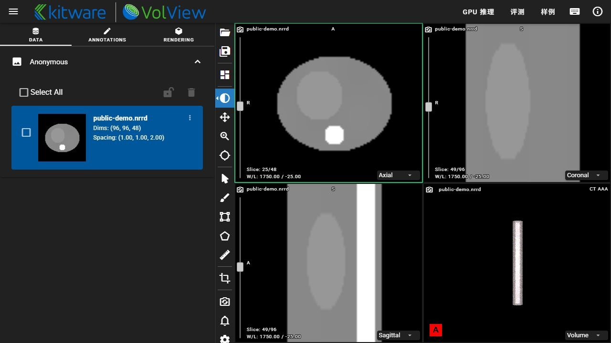

# SegScope · 医学影像分割工作台

界面基于 [Kitware VolView](https://github.com/Kitware/VolView) v4.5.2 的完整应用源码，保留原版阅片布局、三视图、3D 体绘制、标注与测量工具；仅增加本地 GPU 推理和 SegBench 入口。



## 新版界面

使用 Node 22.12+（本次验证 Node 24.19），按顺序执行：

```bash
cd web/volview
npm ci
npm run build
cd ../..
python scripts/serve_workbench.py --port 4200 --runtime http://127.0.0.1:4186
```

打开 http://127.0.0.1:4200 。阅片器可直接加载本地影像；默认展示程序生成的几何 NRRD 样例。GPU 推理连接独立配置的本地服务，见 [运行说明](docs/GPU_RUNTIME.md)。模型源码、适配器、权重及病例数据留在仓库外。

[界面来源与修改范围](docs/VOLVIEW_SOURCE.md) · [GPU 原始测量](docs/MEASUREMENTS.md)

## 原有二维实验流程

## 功能

- 主图像 / 辅助模态上传，Canvas ROI 框选，Lab 快速分割和 GrabCut 精细分割。
- 合成切片样例、辅助模态融合、掩膜 / 叠加图对比与结果下载。
- 处理耗时、面积与连通域统计；没有 GT 时不把这些指标称为准确率。
- 本机私有模型插件接口：模型实现与权重不随通用 Demo 开源。
- 完全本地静态资源，不从第三方加载页面脚本或上传图像。

## 运行

Python 3.10+ 推荐。

```bash
python -m venv .venv
# Linux/macOS: source .venv/bin/activate
# Windows: .venv\Scripts\activate
python -m pip install -r requirements.txt
python scripts/generate_samples.py
python server.py --port 4175
```

打开 http://127.0.0.1:4175 。默认仅绑定回环地址。

```bash
python -m unittest discover -s tests -v
python benchmark.py --mode fast --runs 100 --warmup 10
```

benchmark_results/local_cpu_fast.json 是 2026-09-23 已有合成 RGB 样例的历史测量，均值 56.83 ms、P95 64.71 ms；包含解码、分割、融合和编码。它不是医学模型速度或新加入的合成切片基准。

## 研究模型与保密

[私有模型接口](docs/PRIVATE_PREDICTOR.md) · [开源边界](docs/OPEN_SOURCE_BOUNDARY.md) · [技术设计](docs/TECHNICAL_DESIGN.md)

本仓库不含患者影像、医院资料、基金材料、训练权重、SSH 配置或未公开模型。合成切片仅为几何图形，不是临床影像或医学模型输出。

MIT License。依赖与图标的原始许可证见 THIRD_PARTY_NOTICES.md 和 static/vendor/LICENSE-lucide。